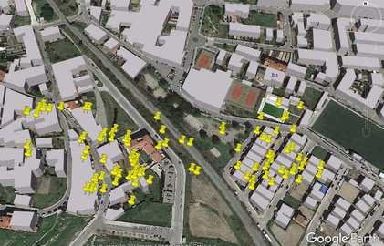

# GS-LOC

```
   ________  _________         .____    ________  _________    
  /  _____/ /   _____/         |    |   \_____  \ \_   ___ \   
 /   \  ___ \_____  \   ______ |    |    /   |   \/    \  \/   
 \    \_\  \/        \ /_____/ |    |___/    |    \     \____  
  \______  /_______  /         |_______ \_______  /\______  /  
         \/        \/                  \/       \/        \/   

 github.com/zadewg/GS-LOC/ :: Ofensive Intelligence Gathering
 Apple Geolocation Services RE. Database Scraper 
 ```
 
### About wifi based geolocation
Wi-Fi positioning system (WPS) or WiPS/WFPS is a geolocation system that uses the characteristics of nearby Wi-Fi hotspots and other wireless access points to discover where a device is located. It is used where satellite navigation such as GPS is inadequate due to various causes including multipath and signal blockage indoors, or where acquiring a satellite fix would take too long. 

The client queries a database which holds geographical coordinates related to Access Points with the APs it sees in range. This data is collected using wardriving techniques, or more recently by crowdsourcing it with the actual clients. Apple Inc, along with Google, hold the two largest databases of this kind.


### GS-LOC Install and Usage

```
$ git clone https://github.com/zadewg/GS-LOC/
$ mv /GS-LOC/ /GSLOC/
$ cd /GSLOC/
$ pip install -r requirements.txt
$ echo "go find Wally!"
```

When querying the Database, it will respond with the location data from the 100 nearest access points.  
> python client.py b4:5d:50:8f:27:c1`
```
BSID MAC: b4:5d:50:8f:27:c1
	Latitude: 59.43188593
	Longitude: 24.76144257
	Accuracy Radius: 50
	Altitude: 12
	Altitude Accuracy: 13
Channel: 1


BSID MAC: 1c:5f:2b:58:f5:ab
	Latitude: 59.43184859
	Longitude: 24.7617564
	Accuracy Radius: 45
	Altitude: 11
	Altitude Accuracy: 5
Channel: 13
```

The program will also generate a KML file which can be imported to Google Maps and other services.
```KML
<?xml version="1.0" encoding="UTF-8"?>
<kml xmlns="http://www.opengis.net/kml/2.2">
<KML_File>
<Document>
	<Placemark>
		<description>1c:5f:2b:8b:79:48</description>
		<Point>
			<coordinates>59.43196212,24.75954368</coordinates>
		</Point>
	</Placemark>
	<Placemark>
		<description>4c:72:b9:d:8:23</description>
		<Point>
			<coordinates>59.43155534,24.76144238</coordinates>
		</Point>
	</Placemark>
</Document>
</kml>
```

Google Earth KML                |        Accuracy        |
:------------------------------:|:----------------------:|
                 | Accuracy radius is narrower in denser urban areas due to a higher loss with distance in signal to noise ratio. |

**Importing GS-LOC**
```python
import GSLOC.client #Make sure the folder is named GSLOC, as python is not cool with hyphens.

MAC = "fc:52:8d:be:eb:5f"
DATA =  client.dbcall([MAC], 0 ,100, False, True) #DATA contains information on all nearby Access Points in a multidimensional array format. First element corresponds to the requested MAC.
print("Mac {} {}".format(MAC, "Latitude: {}, Longitude:{}".format(str(DATA[0][1]), str(DATA[0][1]))))
```

### About Apple's Geolocation Services Reverse Engineering

Apple does not implement Certificate Pinning in the location service API, so it is trivial for an attacker to dinamically sign and intercept messages by manually trusting a CA on the client.

Two subdomains `iphone-services.apple.com` and `gs-loc.apple.com` respond to geolocation queries. The conversation utilizes Protocol Buffers and each request has a `[header][message_size (16bit int)][message]` format.

**Header Format:**
```
NUL SOH      /* 0x0001 start of header */
[length]     /* length of the locale string in bytes */
[locale]     /* en_US */
[length]     /* length of the identifier string in bytes */
[identifier] /* com.apple.locationd */
[length]     /* length of the version string in bytes
[version]    /* 8.4.1.12H321 ie. ios version and build */
NUL NUL      /* 0x0000 end of header */
NUL SOH      /* 0x0001 start of header */
NUL NUL      /* 0x0000 end of header */
```
**Request message scheme:**
```proto
message Request {
	message RequestWifi {
		optional string mac = 1;
	}
	repeated RequestWifi wifis = 2;
	optional int32 noise = 3 [default=0];
	optional int32 signal = 4 [default=100];
	optional string source = 5;
}
```
**Response message scheme:**
```proto
message Response {
	message ResponseWifi {
		message WifiLocation {
			optional int64 latitude = 1;             // X * pow(10, -8)
			optional int64 longitude = 2;            // X * pow(10, -8)
			optional int32 accuracy = 3;             // Radius (meters)
			optional int32 zeroField4 = 4;           // always 0 
			optional int32 altitude = 5;             // -500 if unknown
			optional int32 altitudeAccuracy = 6;     // Not set if altitude=-500
			optional int32 unknown11 = 11;           // [5,63]?
			optional int32 unknown12 = 12;           // [30,4000]?
		}
		optional string mac = 1;
		optional WifiLocation location = 2;
		optional int32 channel = 21;
	}
	repeated ResponseWifi wifis = 2;
}
```


&nbsp;

---

This project is licensed under the MIT License - see the [LICENSE](LICENSE.txt) file for details

**mapez** - [telegram](https://t.me/mapezz)
